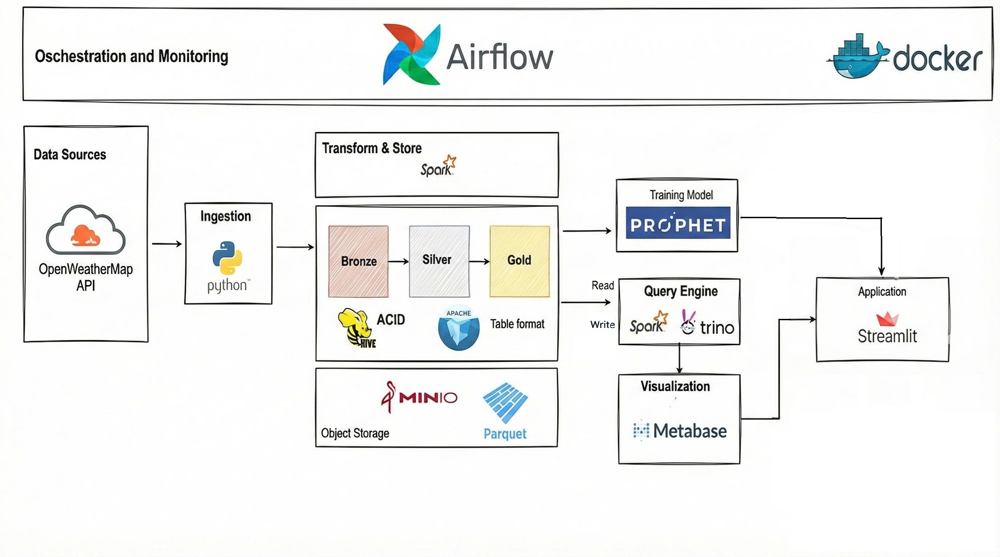

# Xây dựng Data Lakehouse để Phân tích Chất lượng Không khí 


> **Sinh viên thực hiện:** Trần Thị Kim Phượng - 22133044   

---

## Giới thiệu 

Đề tài này xây dựng một hệ thống **Data Lakehouse** hiện đại nhằm giải quyết bài toán giám sát và dự báo ô nhiễm không khí.Hệ thống tự động thu thập dữ liệu từ OpenWeatherMap API, lưu trữ tập trung, xử lý làm sạch và tính toán chỉ số chất lượng không khí (AQI) theo quy chuẩn Việt Nam (QCVN 1459/QĐ-TCMT). 

Đề tài áp dụng kiến trúc **Medallion (Bronze - Silver - Gold)** trên nền tảng Apache Iceberg, giúp nâng cấp Data Lake với khả năng đảm bảo tính toàn vẹn giao dịch (ACID), truy vấn lịch sử (Time Travel) và linh hoạt thay đổi cấu trúc (Schema Evolution).


## Tài liệu chi tiết 

Để giữ cho tài liệu gọn gàng, project được chia thành các phần hướng dẫn chi tiết sau:

1.  **[Kiến trúc Hệ thống](./docs/ARCHITECTURE.md)**: Giải thích chi tiết về luồng dữ liệu Bronze-Silver-Gold và sơ đồ hệ thống.
2.  **[Công nghệ sử dụng ](./docs/TECH_STACK.md)**: Danh sách các công cụ, phiên bản và vai trò của chúng.
3.  **[Cài đặt & Triển khai](./docs/INSTALL.md)**: Hướng dẫn chi tiết cách cấu hình Docker, biến môi trường `.env` và khởi chạy hệ thống.
4.  **[Hướng dẫn Vận hành](./docs/USAGE.md)**: Cách truy cập các giao diện (Airflow, MinIO, App), kích hoạt pipeline và xem dự báo.

## Cấu trúc thư mục (Directory Structure)

```bash
DATA-LAKEHOUSE-PROJECT/
├── app/                            # Mã nguồn ứng dụng Streamlit
├── dags/                           # Các luồng xử lý Airflow (DAGs)
│   ├── ingest_batch_owm.py         # DAG: Thu thập dữ liệu thô từ OpenWeatherMap API 
│   ├── transform_silver_owm.py     # DAG: Trigger Spark job xử lý Bronze -> Silver 
│   └── transform_gold_fact.py      # DAG: Trigger Spark job tính toán AQI Silver -> Gold 
├── docker/                         # Cấu hình Docker build
├── hive-metastore/                 # Cấu hình Hive Metastore
├── spark
│   ├── conf/                       # Cấu hình mặc định Spark  
│   └── scripts/                    # Các Spark Jobs (ETL Scripts)
│       ├── bronze_to_silver_owm.py # ETL: Làm sạch, Flatten JSON & Upsert vào bảng Silver
│       ├── silver_to_gold_fact.py  # ETL: Tính trung bình trượt, chỉ số VN_AQI & tổng hợp bảng Fact
│       ├── export_gold_to_csv.py   # Utility: Xuất dữ liệu báo cáo từ tầng Gold ra CSV
│       └── init_gold_dimensions.py # Utility: Khởi tạo các bảng Dimension 
├── trino/                          # Cấu hình Query Engine 
├── docker-compose.yaml             # File triển khai hạ tầng 
└── README.md                       # Tài liệu hướng dẫn sử dụng

```
---

# Kiến trúc Hệ thống 


---

# Công nghệ sử dụng  

Dự án sử dụng các công nghệ mã nguồn mở hiện đại trong lĩnh vực Kỹ thuật dữ liệu (Data Engineering).

| Phân loại | Công nghệ | Phiên bản | Vai trò trong dự án |
| :--- | :--- | :--- | :--- |
| **Containerization** | **Docker** & **Docker Compose** | Latest | Đóng gói môi trường, triển khai toàn bộ hạ tầng dịch vụ. |
| **Data Lake** | **MinIO** | Latest | Hệ thống lưu trữ đối tượng tương thích S3, chứa dữ liệu Bronze/Silver/Gold. |
| **Table Format** | **Apache Iceberg** | 1.5.0 | Định dạng bảng mở giúp quản lý transaction ACID, Time Travel và Schema Evolution trên Data Lake. |
| **Data Processing** | **Apache Spark** | 3.5.5 | Động cơ xử lý phân tán chính cho các tác vụ ETL và tính toán chỉ số AQI. |
| **Orchestration** | **Apache Airflow** | 2.8.0 | Lập lịch, giám sát và điều phối các luồng công việc (DAGs) tự động. |
| **Metadata** | **Hive Metastore** | 4.0.0 | Quản lý siêu dữ liệu (schema, partition location) của các bảng Iceberg. |
| **Query Engine** | **Trino** | 445 | Thực hiện các truy vấn SQL tương tác tốc độ cao phục vụ phân tích (Ad-hoc Analysis). |
| **Visualization** | **Streamlit** | Latest | Framework Python để xây dựng ứng dụng  |
| **Machine Learning** | **Facebook Prophet** | Latest | Thuật toán dự báo chuỗi thời gian (Time-series Forecasting) cho chỉ số AQI. |

---

# Hướng dẫn Cài đặt & Triển khai (Installation)

## 1. Yêu cầu hệ thống 
* **Docker Desktop** (Đảm bảo Docker Engine và Docker Compose đã được cài đặt).
* **Python 3.8+** (Để chạy ứng dụng Streamlit cục bộ).
* **Git**.
* **RAM:** Tối thiểu 8GB (Khuyến nghị 16GB do chạy nhiều container Spark/Trino).

## 2. Clone mã nguồn dự án
```bash
git clone [https://github.com/ventdejanvier/data-lakehouse-project.git](https://github.com/ventdejanvier/data-lakehouse-project.git)
cd air-quality-lakehouse
```

## 3. Thiết lập biến môi trường (.env)

Do các thông tin cấu hình không được lưu trên GitHub, cần tạo thủ công file môi trường để hệ thống hoạt động.

**Bước 1:** Tại thư mục gốc của dự án (nơi chứa file `docker-compose.yaml`), tạo một file mới đặt tên là `.env`.

**Bước 2:** Copy toàn bộ nội dung dưới đây vào file `.env` đó:

```env
#TÊN DỰ ÁN
COMPOSE_PROJECT_NAME=air-quality-lakehouse

#CẤU HÌNH AIRFLOW
# Key mã hóa dữ liệu kết nối trong Airflow
AIRFLOW_FERNET_KEY=YIIRtmKWP51Y5UPo_FthkSGgwaWMK-EEmn6fa9YW9Qk=
# User ID và Group ID trong container (Mặc định image Airflow dùng 50000)
AIRFLOW_UID=50000
AIRFLOW_GID=0

#CẤU HÌNH MINIO (Object Storage)
# Tài khoản quản trị MinIO (Data Lake)
MINIO_ROOT_USER=minioadmin
MINIO_ROOT_PASSWORD=minioadmin

#API NGUỒN
# Cần đăng ký tài khoản tại [https://openweathermap.org/api](https://openweathermap.org/api) 
# và dán API Key của bạn vào dưới đây:
OWM_API_KEY=your_api_key_here

```

## 4. Khởi động môi trường Docker

Sau khi đã có file cấu hình `.env`, bạn sử dụng Docker Compose để dựng toàn bộ hệ thống.

Mở terminal tại thư mục gốc của dự án và chạy lệnh sau:

```bash
docker-compose up -d --build
```
> **Lưu ý quan trọng:** Lần đầu tiên khởi chạy, quá trình này có thể mất từ **5-10 phút** để tải xuống các Docker images.

Để kiểm tra xem các dịch vụ đã khởi động thành công chưa, bạn hãy chạy lệnh:

```bash
docker-compose ps
```

## 5. Cài đặt môi trường cho Ứng dụng (Streamlit)

Để chạy Ứng dụng (`app.py`), khuyến nghị bạn nên chạy trên máy cục bộ (Local) thay vì trong Docker để có hiệu năng tốt nhất.

Mở một terminal mới (không tắt terminal đang chạy Docker) và thực hiện các bước sau:

**Bước 1: Tạo môi trường ảo Python**

```bash
python -m venv .venv
```

**Bước 2: Kích hoạt môi trường**

* **Trên Windows:**
    ```bash
    .venv\Scripts\activate
    ```
* **Trên Mac/Linux:**
    ```bash
    source .venv/bin/activate
    ```

**Bước 3: Cài đặt các thư viện cần thiết**

Bạn cần cài đặt các thư viện Python mà ứng dụng yêu cầu (Streamlit, Plotly, Prophet, v.v.):

```bash
pip install streamlit plotly prophet pandas pyjwt
```
--- 

# Hướng dẫn Vận hành 

Sau khi quá trình cài đặt và khởi chạy Docker hoàn tất, bạn có thể bắt đầu vận hành hệ thống.

## 1. Truy cập các cổng dịch vụ  

Hệ thống cung cấp các giao diện web để quản trị và giám sát. Bạn có thể truy cập thông qua trình duyệt theo bảng dưới đây:

| Dịch vụ | URL Truy cập | Tài khoản mặc định |
| :--- | :--- | :--- |
| **Airflow UI** | `http://localhost:8080` | `admin` / `admin` |
| **MinIO Console** | `http://localhost:9001` | `minioadmin` / `minioadmin` | 
| **Trino UI** | `http://localhost:8090` | `admin`|
| **Metabase** | `http://localhost:3000` | *(Cần setup lần đầu)* |

## 2. Kích hoạt Pipeline dữ liệu (ETL)

Để hệ thống bắt đầu thu thập và xử lý dữ liệu, bạn cần kích hoạt các luồng xử lý (DAGs) trên Airflow.

**Bước 1:** Truy cập **Airflow UI** tại địa chỉ `http://localhost:8080`.

**Bước 2:** Tại danh sách DAGs, hãy tìm và gạt nút **Unpause** (chuyển sang màu xanh dương) cho các DAG theo thứ tự sau để đảm bảo luồng dữ liệu chảy đúng:

1.  `ingest_batch_owm`: Thu thập dữ liệu thô từ API về Data Lake.
2.  `transform_silver_owm`: Làm sạch và chuyển đổi dữ liệu sang bảng Iceberg.
3.  `transform_gold_fact`: Tính toán chỉ số AQI và tổng hợp dữ liệu báo cáo.

> **Lưu ý:** Hệ thống được cấu hình `catchup=True`. Ngay khi bạn bật DAG, Airflow sẽ tự động kích hoạt chế độ **Backfill** để chạy bù dữ liệu quá khứ (từ năm 2020 đến nay). Bạn có thể theo dõi tiến trình chạy trong cột "Recent Tasks" hoặc "Grid View".

## 3. Sử dụng Ứng dụng Streamlit

Sau khi các luồng dữ liệu trên Airflow đã chạy và nạp dữ liệu vào Data Lake, bạn có thể khởi chạy Ứng dụng Streamlit để giám sát và phân tích.

**Bước 1: Khởi chạy ứng dụng**

Tại terminal (đã kích hoạt môi trường ảo `.venv`), chạy lệnh sau:

```bash
streamlit run app/app.py
```

Truy cập địa chỉ `http://localhost:8501` trên trình duyệt để mở ứng dụng.

### Bước 2: Các chức năng chính

* **Dashboard (Giám sát điều hành):**
    * **Hiển thị các KPI thời gian thực:** Cung cấp chỉ số VN_AQI trung bình và nồng độ bụi mịn PM2.5 cao nhất trong lịch sử.
    * **Biểu đồ xu hướng chất lượng không khí:** Trực quan hóa biến động của chỉ số AQI theo thời gian.
    * **Giám sát chất lượng dữ liệu:** Biểu đồ phân tán giúp phát hiện nhanh các ngày thiếu dữ liệu thu thập (các điểm màu đỏ/vàng) để có kế hoạch chạy bù.

* **Analytics (Phân tích chuyên sâu):**
    * **Tích hợp Metabase:** Hiển thị các Dashboard từ nền tảng Metabase trực tiếp trong ứng dụng thông qua cơ chế xác thực bảo mật JWT.
    * **Phân tích nâng cao:** Cung cấp các biểu đồ chuyên sâu về tương quan giữa các chất ô nhiễm và mô hình phân bố theo thời gian.

* **Forecasting (Dự báo AI):**
    * **Cấu hình tham số:** Chọn chỉ số mục tiêu (ví dụ: `VN_AQI`, `PM2.5`,...) và số ngày cần xem dự báo.
    * **Thực thi:** Nhấn nút **Run**. Hệ thống sẽ huấn luyện mô hình **Facebook Prophet** với dữ liệu lịch sử và hiển thị biểu đồ dự báo kèm dải tin cậy (Confidence Interval).

* **System Admin (Quản trị hệ thống):**
    * Vào tab **System Admin** trên thanh điều hướng bên trái.
    * **Mục Pipeline Orchestration:** Cho phép Bật/Tắt các luồng xử lý (DAGs) của Airflow trực tiếp từ giao diện.
    * **Mục Data Synchronization:** Nhấn nút **Sync Now** để chạy Spark Job đồng bộ dữ liệu mới nhất từ Data Lake (tầng Gold) về ứng dụng.

